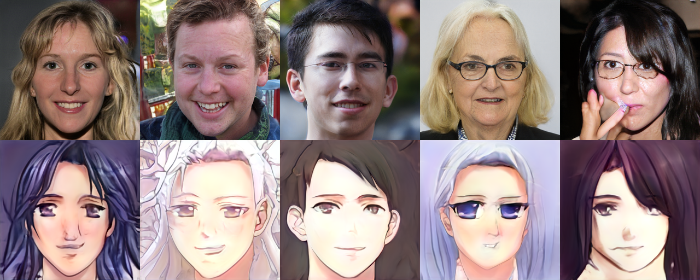

## Human-Anime face translation
<div align=center>

</div>

### Introduction
This project is my master thesis, which transfers human face images into anime ones. The code and idea are heavily based on [FreezeG](https://github.com/bryandlee/FreezeG). The main difference with FreezeG is using style-transfer and then reverse generation here. For the structure and ideas of the model, please check this [slides](https://github.com/jennifer66666/master_thesis_code/blob/master/p5120fg52.pdf).
### Environment
#### start a container
```
cd ~ # to mount dir \thesis under this working path
docker run --rm -it -d --gpus all -v ~/thesis:/thesis test2:v2
docker exec -it 69d1 bash
# (855b gdrive installed --NO, installed things will lost by entering with docker exec)
```
#### re-entry a tmux
```
tmux a -t session1
```
### Training
```
mkdir sample
mkdir checkpoint
python3 -m torch.distributed.launch --nproc_per_node=3 FreezeG/stylegan2/train.p y --batch 8 prepared_input/prepared_gendermix/ --finetune_loc 4 --iter 600000 -- wandb --ckpt 550000.pt
```
also need to change the comment in model.py
```
    if not input_is_latent:  
        ## for train.py: is_input_latent = False  
        styles = [self.style(s) for s in styles]  
        ## for projector.py: is_input_latent = False  
        # styles = [self.style(torch.unsqueeze(s,0)) for s in styles]  
        # if another_style:  
        #    another_style = [self.style(torch.unsqueeze(s,0)) for s in another_style]  
```
### Generation
#### generate human and anime pair that not look alike with original FreezeG method
```
python3 FreezeG/stylegan2/generate_pair.py --size 256 --ckpt2 checkpoint/570000.pt --input_is_latent
```
#### step1.train 5800.pt with kaggle rather than mange 2.generate_pair transfer part 3. reverse generate
```
python3 FreezeG/stylegan2/generate_pair.py --ckpt2 checkpoint/580000.pt --transfer_part 3 --input_is_latent
python3 FreezeG/stylegan2/generate_pair.py --size 256 --ckpt2 checkpoint/570000.pt --input_is_latent --single_file nacio_3.pt
```
#### reverse project an image
```
python3 FreezeG/stylegan2/projector.py --ckpt checkpoint/580000.pt images_input_source/550000real_generated/000003.png --input_is_latent
```
