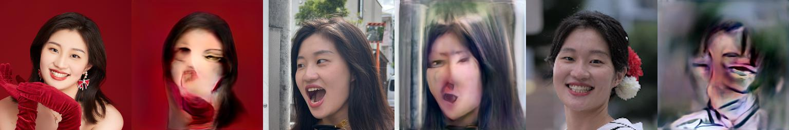

## Human-Anime face translation
<div align=center>

</div>
<div align=center>
First Row : input (not real photos but output from SytleGAN2)
</div>
<div align=center>
Second Row : output from this project.
</div>


### Introduction
This project is my master thesis, which transfers human face images into anime ones. The code and idea are heavily based on [FreezeG](https://github.com/bryandlee/FreezeG). The main difference with FreezeG is using style-transfer and then reverse generation here. Reason to do the change,  is because finding that the anime output straightly from FreezeG for some datasets has no correspondance to the input human face (see examples below #FIXME). For the structure and ideas of the model, please check this [slides](https://github.com/jennifer66666/master_thesis_code/blob/master/p5120fg52.pdf). The details of training, processed input, and model weights (570000.pt, 550000.pt) can be downloaded from the [gdrive_link](https://drive.google.com/drive/folders/1VceRUYdi3oR3V7Gc0UedaLWcBWFsdBIk?usp=sharing).
### Environment
Using the Tensorflow + Pytorch environment that FreezeG wants together is kinda difficult. It's much easier to install the environment with Docker. According to this https://github.com/rosinality/stylegan2-pytorch/issues/11 I made the dockerfile. And to use tmux is for keeping training session on server when I close my laptop remotely. 
#### start a container
```
cd ~ # to mount dir \thesis under this working path
docker run --rm -it -d --gpus all -v ~/thesis:/thesis test2:v2
docker exec -it 69d1 bash
# (855b gdrive installed --NO, installed things will lost by entering with docker exec)
```
#### start and re-entry a tmux
```
tmux new -s session1
tmux a -t session1
```
### Dataset
Experimented with different anime datasets, such as one-piece, danbooru, and naruto. But the below one from kaggle somehow works the best.
https://www.kaggle.com/datasets/splcher/animefacedataset

### Training
```
mkdir sample
mkdir checkpoint
python3 -m torch.distributed.launch --nproc_per_node=3 FreezeG/stylegan2/train.p y --batch 8 prepared_input/prepared_gendermix/ --finetune_loc 4 --iter 600000 -- wandb --ckpt 550000.pt
```
also need to change the comment in model.py
```
    if not input_is_latent:  
        ## for train.py: is_input_latent = False  
        styles = [self.style(s) for s in styles]  
        ## for projector.py: is_input_latent = False  
        # styles = [self.style(torch.unsqueeze(s,0)) for s in styles]  
        # if another_style:  
        #    another_style = [self.style(torch.unsqueeze(s,0)) for s in another_style]  
```
### Generation
####Generate human and anime pair that not look alike with original FreezeG method
```
python3 FreezeG/stylegan2/generate_pair.py --size 256 --ckpt2 checkpoint/570000.pt --input_is_latent
```
#### Step1.train 5800.pt with kaggle rather than mange 2.generate_pair transfer part 3. reverse generate
```
python3 FreezeG/stylegan2/generate_pair.py --ckpt2 checkpoint/580000.pt --transfer_part 3 --input_is_latent
python3 FreezeG/stylegan2/generate_pair.py --size 256 --ckpt2 checkpoint/570000.pt --input_is_latent --single_file nacio_3.pt
```
#### Reverse project an image
```
python3 FreezeG/stylegan2/projector.py --ckpt checkpoint/580000.pt images_input_source/550000real_generated/000003.png --input_is_latent
```
### Problems remain
when input is real human photos, the output falis.
<div align=center>

</div>

### Cases that FreezeG fail
FreezeG works perfectly for Simpson family, but no correspondence between input and output for anime dataset.
<div align=center>

</div>

### More output examples
First row: input.  
Second row: style transfer.  
Third row: output, reverse generation.
<div align=center>


</div>

